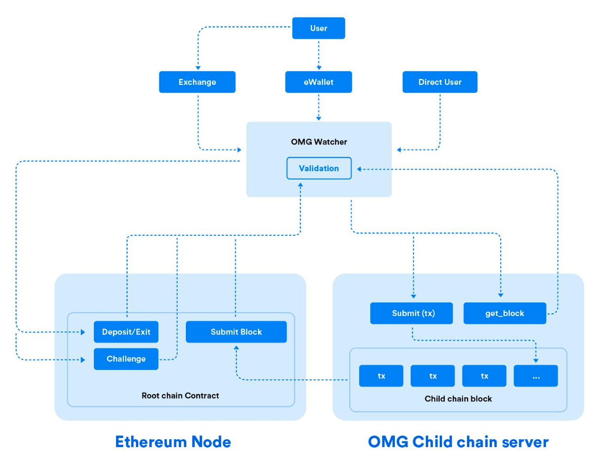
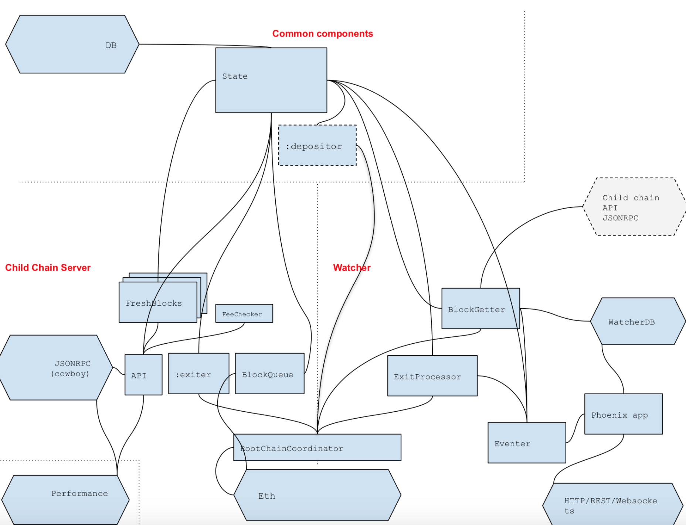

## Overview
This page provides a high level description of the architecture of the `elixir-omg` apps.

The image illustrates the OmiseGO blockchain architecture components, and where the umbrella app fits in. 

> Important! The image is intended as a general, high-level guide only, indicating where the umbrella app fits in with other components.

## Interactons between child chain, server, watcher

This section describes process interactions that build up the child chain server and Watcher, illustrated in this figure: 

> Hexagonal shapes represent wrapper components (port/adapter); that is, pointing to something external. Rectangular shapes represent internal components.

**NOTE:**
You can find more information about the function of the processes/modules in  the respective docs in `.ex` files:

- for `OMG` modules/processes look in `apps/omg`
- for `OMG.ChildChain` modules/processes look in `apps/omg_child_chain`
- for `OMG.Watcher` modules/processes look in `apps/omg_watcher`
- for `OMG.Eth` look in `apps/omg_eth`
- for `OMG.DB` look in `apps/omg_db`
- for `OMG.Performance` look in `apps/omg_performance`
- for `OMG.ChildChainRPC` look in `apps/omg_child_chain_rpc`

### `OMG.State`

* writes blocks and UTXO set to `OMG.DB`
* pushes freshly formed blocks to `OMG.ChildChain.FreshBlocks`

### `OMG.ChildChain`

* accepts child chain transactions, decodes, stateless-validates and executes on `OMG.State`
* forwards `get_block` requests to `OMG.ChildChain.FreshBlocks`

### `OMG.ChildChain.FreshBlocks`

* reverts to reading `OMG.DB` for old blocks

### `OMG.RootChainCoordinator`

* reads Ethereum block height from `OMG.Eth`
* synchronizes view of Ethereum block height of all enrolled processes (see other processes descriptions)

### `:exiter`

* Actually `OMG.EthereumEventListener`, setup with `:exiter`.
    Note that there are many exiter-related processes that perform in a similar way, but these are not listed here.
* pushes exit-related events to `OMG.State` on child chain server's side
* pushes exit-related events to `OMG.Watcher.ExitProcessor` on watcher's side
* pushes exit-related events to `WatcherDB`

### `:depositor`

* Actually `OMG.EthereumEventListener`, setup with `:depositor`. 
* pushes deposits to `OMG.State`
* pushes deposits to `WatcherDB`

### `OMG.ChildChain.BlockQueue`

* requests `form_block` on `OMG.State` and takes block hashes in return
* tracks Ethereum height and child chain block submission mining via `OMG.Eth` and `OMG.RootChainCoordinator`

### `OMG.ChildChain.FeeServer`

* `OMG.ChildChain` calls this component to get acceptable currencies and actual fee amounts to validate transactions

### `OMG.Watcher.BlockGetter`

- tracks child chain blocks via `OMG.RootChainCoordinator`
- manages concurrent `Task`'s to pull blocks from child chain server API (JSON-RPC)
- pushes decoded and statelessly valid blocks to `OMG.State`
- pushes statefully valid blocks and transactions (acknowledged by `OMG.State` above) to `WatcherDB`
- emits block, transaction, consensus events to `OMG.Watcher.Eventer`
- stops if `OMG.Watcher.ExitProcessor` reports a dangerous byzantine condition related to exits

### `OMG.Watcher.ExitProcessor`

- get various Ethereum events from `OMG.EthereumEventListener`
- used only in Watcher
- validates exits
- emits byzantine events to `OMG.Watcher.Eventer`
- spends finalizing exits in `OMG.State`

### `Phoenix app`

- uses data stored in the `WatcherDB` to server user's requests
- subscribes to event buses to `OMG.Watcher.Eventer`

### `OMG.Watcher.Eventer`

- pushes events to `Phoenix app`

### `OMG.Performance`

- executes requests to `OMG.RPC`
- forces block forming by talking directly to `OMG.State`

## Databases

This section describes the two databases that exist.

> Note: It may be confusing that there are two databases. We anticipate that this may change in future.

### `OMG.DB`

This is an *intimate* database for `OMG.State` that holds the UTXO set and blocks.

It may be seen and read by other processes to sync on the persisted state of `OMG.State` and UTXO set by consequence.

Non-relational data, so we're having a simple KV for this.

Implemented with `leveldb` via `ExlevelDB`, possibly to be swapped out for anything better in the future.
Each instance of either Child Chain Server or Watcher should have it's own instance.

Database necessary to properly ensure validity and availability of blocks and transactions

- it is read by `OMG.State` to discover the UTXO set on restart
- it is read by many other processes to discover where they left off, on restart

### `WatcherDB` 

A convenience database running alongside the Watcher **only**.

Holds all information necessary to manage the funds held:
- UTXOs owned by user's particular address(es)
- all transactions to be able to challenge
- transaction history

Relational data, to be able to navigate through the transactions and UTXOs.

Implemented with Postgres (SQLite for test runs).

This database might be shared between Watchers, e.g. when it pertains to a single wallet provider running multiple eWallet instances for scaling.