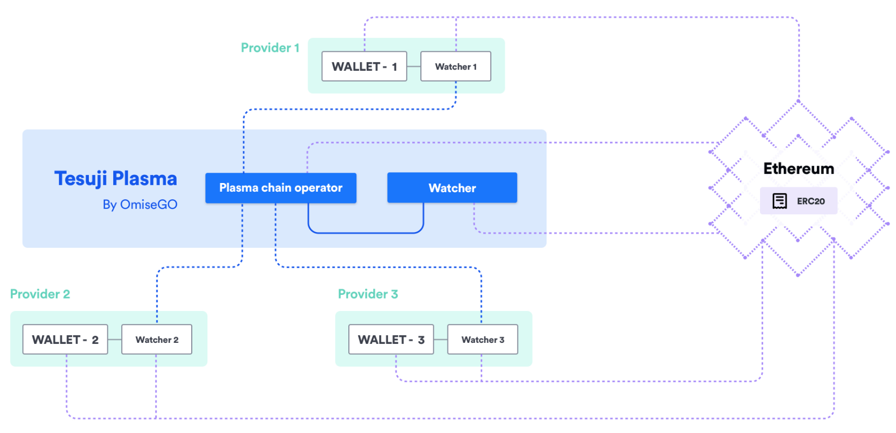

The [elixir-omg repository](https://github.com/omisego/elixir-omg) on GitHub contains OmiseGO's Elixir implementation of Plasma and forms the basis for the OmiseGO Network.

The first release of the OmiseGO Network is based on Tesuji Plasma, an iterative design step over Plasma MVP.

The diagram illustrates the relationship between the wallet provider and how wallet providers connect to Tesuji Plasma:

> See [Blockchain design](blockchain-design.md) for a full description for the child chain server and Watcher. Note that all parts of that design have been implemented!