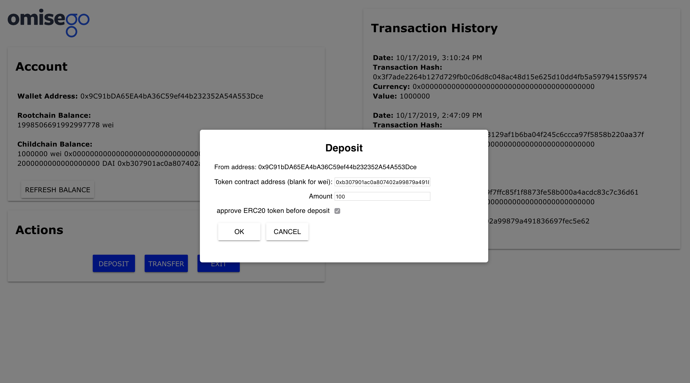
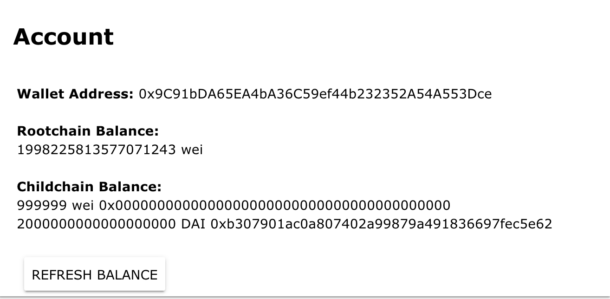
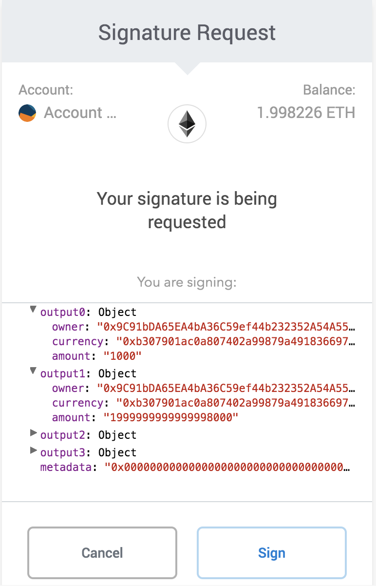

# Using a browser for DAI transactions on the OmiseGO Network

Estimate reading time: 5 minutes

**Overview**

This guide introduces you to the Plasma interface, and shows you how to make Plasma transactions directly from your browser, using DAI as ERC20 token.

You will learn first-hand how to use ERC20 interactions with Plasma to make a `deposit`, `transfer`, and `exit`.

**Important**! This guide is intended for Samrong, and for any v0.2 instance of the OmiseGO Network.

**Before you start**

Ensure you have the following installed:
- node-js >10.0.0
- npm > 6.0.0
- You will also need access to the following:
  - A code editor
  - A browser with a web3 wallet, such as MetaMask

#### Getting started
This section explains what you'll need to do to set up your environment.

1. Clone the latest version of `js-starter-kit` onto your local machine. You can find the repo here: https://github.com/omisego/js-starter-kit

2. In a text editor, open up the following file: `config.js`

3. In `config.js`, replace the current configuration with the network endpoints for Samrong; then, save your changes.
You'll find the network endpoints for Samrong in this file: https://github.com/omisego/dev-portal/blob/master/guides/network_endpoints.md

4. Run `npm install` to install the dependencies.

5. Run `npm run dev` to start the app.

### Transact with DAI on the OmiseGO Network

An end-to-end process of making DAI transactions on the OmiseGO Network involves the following:

1. Fund your wallet with DAI.
2. Deposit DAI.
3. Transfer DAI.
4. Exit the DAI UTXO

#### Fund your wallet with DAI

The client-side wallet relies on the funds you have on your existing account.

Before you can start transacting on the OmiseGO Network, you'll need to fund your wallet with some Rinkeby Testnet DAI.

You'll need DAI for the following:

- To run the JS-Starter-kit
- To make ERC20 transactions
You can find DAI ERC20 contract here:
https://rinkeby.etherscan.io/address/0xb307901ac0a807402a99879a491836697fec5e62

#### Deposit, transfer, and exit

This section explains how you can deposit ERC20 tokens to update your child chain balance, transfer DAI tokens to a recipient, and exit the DAI UTXO.

Perform these steps:

1.Before depositing any ERC20 token, you'll need to first approve the amount:

  1.1 Click **Deposit**.
  
  1.2 Enter the DAI token contract address.
  
  1.3 Choose the amount you would like to deposit, in DAI.
  
  1.4 Select the checkbox to approve the ERC20 token before deposit; then, click **Okay**.
  
  1.5 On the MetaMask popup, click **Confirm**. The transaction is confirmed.

  

2.Once the transactions are confirmed, you can make the deposit:

  2.1 Click **Deposit**.

  2.3 Enter the DAI token contract address.

  2.4 Select the amount you wish to deposit, in DAI.

  2.5 Leave the Approve checkbox unchecked, and click 
  **Okay**.

  2.6 On the MetaMask popup, click **Confirm** to verify the ERC20 deposit.

  2.7 Click **Refresh** to update the balance. The child chain balance updates with the new DAI amount.

  **Note**: _Balance refresh may take a few minutes. The balance displays in the lowest denomination of the ERC20 token (18 digits for DAI)._

3.Now you're going to transfer DAI:

  3.1 Click **Transfer**.

  3.2 Select **DAI** as the token you wish to transfer.

  3.3 Fill out the amount you wish to transfer.

  3.4 Specify the recipient address; then, click **Okay**.
  **Note**: _This can be another wallet you own on MetaMask._

  3.4 On the system message that displays to confirm your signing attempt, inspect the inputs and outputs of your transactions.

  3.5 Once you have verified that the transaction details are accurate, click **Confirm**.

  3.6 To view the status of your transaction, open the browser console to retrieve the TX hash; then, search for the hash through Plasma Block Explorer, where you can also view the transaction details.

4.Finally, you're going to exit:

  4.1 Click Exit.

  4.2 Select the DAI UTXO that you wish to exit.

  4.3 Click Okay.

Congratulations, you have completed an end-to-end process of making DAI transactions on the OmiseGO Network!

