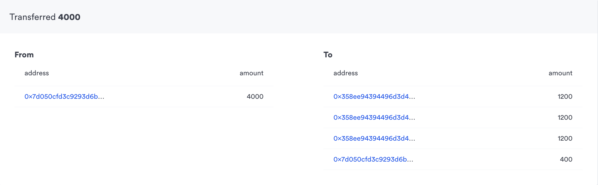
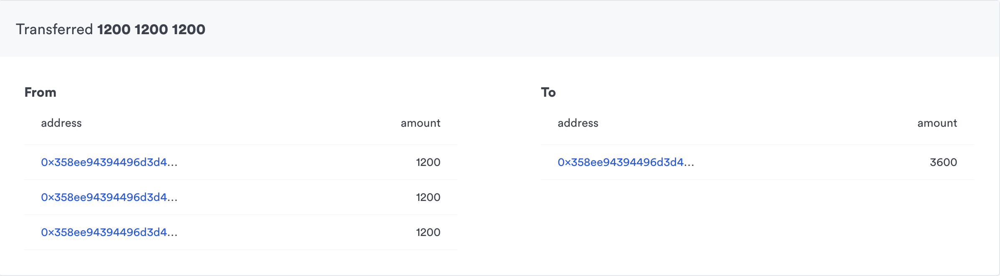
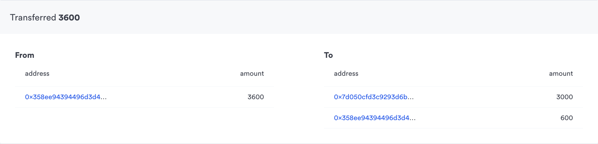

# Making Sense of UTXOs

Estimated time: 20 minutes

Goal:

- To understand how UTXOs work
- To learn how to split and merge complex UTXOs
- To get first hand experience making transactions from your terminal

In this guide, we will help you gain a better understanding of how UTXOs work by running through an actual example.

Unlike Ethereum, a plasma chain units of transactions are in UTXOs aka Unspent Transaction Output. If you have developed application on a Bitcoin-based blockchain, you will find the paradigm to be quite similar (with a few caveats).

If you haven't already, make sure you have gone through the first Guide on [Running Plasma Transactions on the browser](https://github.com/omisego/dev-portal/blob/master/guides/plasma_interface_from_browser.md).

### Note

This guide is meant for **samrong** and any v0.1 instance of OMG Network

### Managing Complex UTXOs

In order to simulate these more complex transactions, we will be utilizing `Plasma CLI` a golang command line tool to make interactions with both Rootchain and Childchain easier.

So let's dig in by exploring a simple scenario:

1. Alice would like to deposit her funds into the child chain and send 3 small chunks to Bob. Keeping some change to herself

2. Bob then wants to take all the 3 chunk of UTXOs that he has and merge it to 1 single UTXO.

3. Bob sends back the funds he received from Alice, keeping some change to himself


### Installation

Luckily for us, the cli is compiled to binary, so it should be able to run on your machine regardless of whether you have Windows, Linux or Mac.
Refer to the installation guide here https://github.com/omisego/plasma-cli/

Let's get started

### Create and Fund Account


Firstly, let's create a wallet for both Alice, run the following command:
`./plasma_cli create account`

Now that you have Alice's account, we will to fund it with some ETH. Go ahead and send your Rinkeby Testnet ETH to Alice's new address


### Deposit on Rootchain

Let's try to deposit to the Rootchain contract now. Run the following command to deposit 4000 wei to Alice's wallet:

```
./plasma_cli deposit --privatekey="alice_private_key" --client="https://rinkeby.infura.io" --contract="0x740ecec4c0ee99c285945de8b44e9f5bfb71eea7" --owner="alice_address" --amount=4000 --currency="ETH"
```

Don't forget to wait for transaction confirmation. After around two minutes, you should be able to see your UTXO on the plasma chain. Let's try to query your new UTXO:

```
./plasma_cli get utxos --watcher="http://watcher.samrong.omg.network/" --address="alice_Address"
```

you should see a `UTXO position`, we will have a use for this in the next step

### Making a split transaction

Run `./plasma_cli create account` again to make Bob's wallet. Now, we will make the transaction to split Alice's single UTXO into 3.

```
./plasma_cli split --fromutxo=UTXO_position --privatekey="alice_privatekey" --toowner="bob_address" --outputs=3 --toamount=1200 --watcher="http://watcher.samrong.omg.network/"
```

The above transaction will create a 1 input, 4 outputs transaction as shown visually below. Where the first 3 Outputs are our 1200, and the last value is change to send back to Alice



Now, verify that the transaction is made to Bob by calling

```
./plasma_cli get utxos --watcher="http://watcher.samrong.omg.network/" --address="bob_Address"
```

You should see 3 UTXOs appeared for Bob

### Making a merge transaction

Having 3 dust UTXOs are not very helpful, For real world scenarios- Bob would most likely want to cosolidate his UTXOs to something easily spendable and exitable, giving less overhead for Bob's wallet to manage his funds. So our next goal is to merge these UTXOs for Bob.

```
./plasma_cli merge --fromutxo=UTXO_pos_1 --fromutxo=UTXO_pos_2 --fromutxo=UTXO_pos_3 --privatekey="bob_private_key" --watcher="http://watcher.samrong.omg.network/"
```

the above transaction will take the 3 UTXOs input from Bob and accumulate it into a single large UTXO output. As shown in diagram below



Verify that this works by running get UTXOs function again.

```
./plasma_cli get utxos --watcher="http://watcher.samrong.omg.network/" --address="bob_Address"
```

only a single UTXO should be returned.

### Sending a Transation

Now that we have a single UTXO, we can conveniently send some funds back to Alice

```
./plasma_cli send --fromutxo=UTXO_pos --privatekey="bob_privatekey" --toowner="alice_address" --toamount=3000 --watcher="http://watcher.samrong.omg.network/"
```

The transaction above is simply a 1 input, 2 outputs. Where the first input is amount you send to Alice, and the second being the change sent back to Bob as shown below.



That's it, you just learned the mental model of plasma `merge` and `split` transactions.

### Transaction fees
Note that transactions require fees to be paid. See here for an explanation of how fees work: [Transaction fees](https://github.com/omisego/dev-portal/blob/master/guides/transaction_fees.md).
